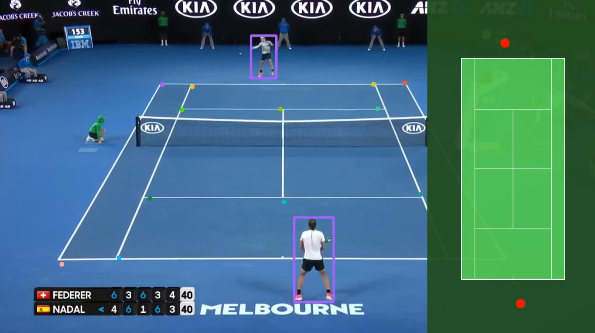

# 🎾 Tennis Autodistillation: Dataset Generation and Model Training

Welcome to **Tennis Autodistillation project**! 👋

This project focuses on creating foundation models to generate datasets used to train specialized models for:  
🏷️ **Frame Classification**  
🕺 **Tennis Player Detection**  
📍 **Court Keypoints Detection**  

Autodistillation is essential for this project, as it enables the use of foundational models (such as **ChatGPT Vision** and **Grounded SAM**) to label our dataset, providing the groundwork needed to train our specialized models.

🎥 Watch the demo video: [Tennis Autodistillation Demo](https://drive.google.com/file/d/1jyFV8Z-Xo9iQFWdJeeerkqdbP0DuoRWq/view?usp=sharing)  
📄 Project presentation: [Download PDF](https://github.com/rafaelpadilla/tennis_autodistill/raw/main/tennis_autodistillation_slides.pdf)

--------------

[](https://drive.google.com/file/d/1jyFV8Z-Xo9iQFWdJeeerkqdbP0DuoRWq/view?usp=sharing)

--------------

### 🚀 Installation

Follow these steps to get started:

1. **Create and activate a Python environment** (requires Python 3.13) - here we use conda:

```bash
conda create -n tennis-autodistill python=3.13
conda activate tennis-autodistill
```

2. **Clone the repository** and install the dependencies:
```bash
git clone https://github.com/yourusername/tennis-autodistill.git
cd tennis-autodistillation
pip install -r requirements.txt
pip install -e .
```
--------------

### 🛠️ Usage

To use the project, open and follow the steps in this Jupyter notebook: `tennis_autodistill.ipynb`.

 **⚠️ Attention:** I highly recommend to watch the instruction videos first. They will help you understand the project and the decisions behind the code.
- [The pipeline and overview of the project](https://drive.google.com/file/d/1EftccAKo-N-nUBJ5qratIvBshGeHQcJX/view?usp=sharing)
- [Dataset creation](https://drive.google.com/file/d/1PmVXhOrNdSUDY6gIXLKy9VuXPkRdfkcB/view?usp=sharing)
- [Estimating court points](https://drive.google.com/file/d/1apjGZCoc_KYSnWwLeMuUVPVg7nsdCmp-/view?usp=sharing)
- [Go-through notebook](https://drive.google.com/file/d/1GEj_j3hZORNFufngyf5F85w6xMkK6tH-/view?usp=sharing)

--------------

### 📍 Court Minimap Reference

The [minimap](https://github.com/rafaelpadilla/tennis_autodistill/blob/main/tennis_court_full_map.png) used in this project follows the official International Tennis Federation (ITF) court measurements and guidelines.
* [Official ITF Rules (2025 edition)](https://www.itftennis.com/media/7221/2025-rules-of-tennis-english.pdf)
* [Harrod Sport - Tennis Court Dimensions & Size](https://www.harrodsport.com/advice-and-guides/tennis-court-dimensions)

--------------

### 🤝 Contribute
We welcome and appreciate contributions to the project! Feel free to submit pull requests (PRs) or open issues with suggestions or improvements. Your support helps us make the project even better!


